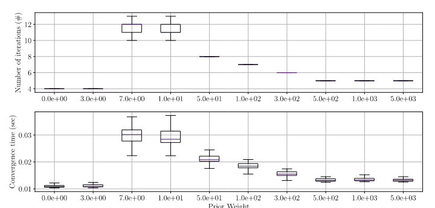
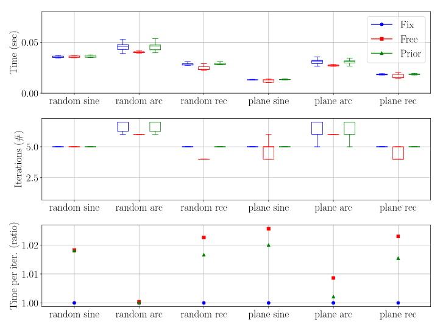

# Handling Gauge Freedom in VINS

> Z. Zhang, G. Gallego, and D. Scaramuzza, "On the Comparison of Gauge Freedom Handling in Optimization-Based Visual-Inertial State Estimation," _IEEE Robot. Autom. Lett._, vol. 3, no. 3, pp. 2710–2717, Jul. 2018, doi: [10.1109/LRA.2018.2833152](https://doi.org/10.1109/LRA.2018.2833152).

这篇论文主要讨论了视觉惯性系统中规范自由度（Gauge Freedom）的处理方法，并对比了不同策略的效果。

<!-- more -->

## 三种处理方法

视觉惯性系统存在四自由度不可观（平移和绕重力方向的旋转），高斯牛顿法求解线性方程时，奇异矩阵 H 不满秩（存在四维的零空间），求解稳定性较差。这些额外的规范自由度 Gauge Freedom 必须被妥善处理。作者对比了三种常见的处理策略以及它们对应的效果。

### Gauge Fixation

选择将第一帧的摄像机位姿固定，在全局优化中不更新。这等价于在全局优化时将第一帧摄像机位姿对应的残差的雅可比矩阵设为零矩阵。

### Gauge Prior

选择为第一帧位姿加上定义在流形上的正则化惩罚项：
$$||\mathbf r_0^P||_{\Sigma_0^P}^2=||(\mathbf p_0-\mathbf p_0^0,\Delta\phi_{0z})||_{\Sigma_0^P}^2$$

### Free Gauge

方法则不增加先验约束，而是在优化时使用阻尼牛顿法，使 $\epsilon\mathbf I+\mathbf H$ 正定。

## 收敛性分析

在权重矩阵等于协方差构成的单位阵 $\mathbf\Sigma_0^P = \boldsymbol\sigma_0^2\mathbf I$ 时：
$$||\mathbf r_0^P||_{\Sigma_0^P}^2=w^P||\mathbf r_0^P||^2, w^P = \frac1{\sigma_0^2}$$

当 $w^P\to\infty$ 时，**Gauge Prior** 变成 **Gauge Fixation**，当 $w^P=0$ 时，**Gauge Prior** 变成 **Gauge Free**。

权重 $w$ 对均方误差、迭代次数、收敛时间的影响都不大，并且在超过某个阈值后，三者都趋于平稳。

/// caption
///

作者进一步实验讨论这种反常的收敛时间的增加：

- 对于非常大的先验权重 $10^8$，该算法会降低重新投影误差，同时保持先验误差几乎等于零。
- 对于较小的先验权重（例如 $50\sim500$），优化算法会在前两次迭代中降低重新投影误差，但代价是增加先验误差。然后优化算法花费许多次迭代来微调先验误差，同时保持重新投影误差较小（沿轨道移动），因此计算时间会增加。

/// caption
///

总的来说，三种方法对精度的影响并不显著。在权重合适的情况下，**Gauge Prior** 方法与 **Gauge Fixation** 几乎有相同的表现，而 **Free Gauge** 方法由于需要更少的迭代次数来收敛，消耗的时间会较少。
