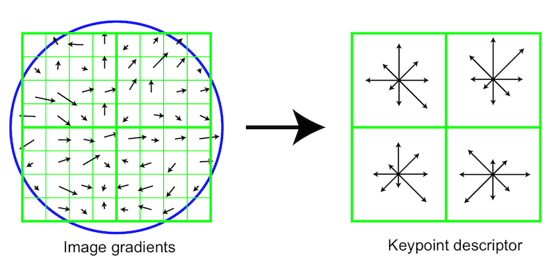
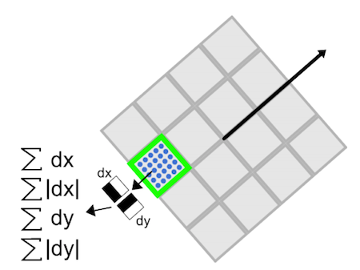
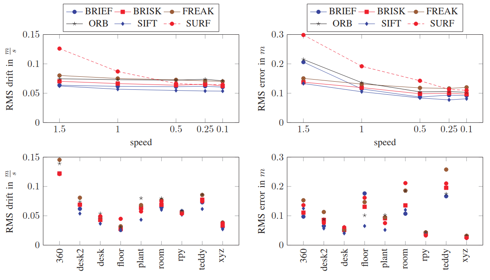

# Classic Visual Feature Descriptors

Experiments show that different visual descriptors tend to have similar rates of outliers in feature matching, and the precision differences brought by the application of different feature descriptors in Visual SLAM are negligible.

{width="500"}

<!-- more -->

## SIFT: Scale-invariant Feature Transform

Scale invariance is mainly ensured by the introduction of convolution kernels of varying sizes during feature detection, which will not be discussed here. How, then, is rotation invariance achieved?

Firstly, during detection, the magnitude and direction of the gradient for each pixel are pre-calculated.

$$
\begin{aligned}
m(x,y) &= \sqrt{[L(x+1,y)-L(x-1,y)]^2+[L(x,y+1)-L(x,y-1)]^2} \\
\theta(x,y) &= \arctan\frac{L(x,y+1)-L(x,y-1)}{L(x+1,y)-L(x-1,y)}
\end{aligned}
$$

Next, according to the gradient direction of the pixels, the product of the gradient magnitudes is added to the histogram with weights based on the normal distribution probability of the distance from the center point. The direction in the histogram that corresponds to the interval from the maximum value to the 80% of maximum value is identified as the orientation of the feature point (if there are multiple candidate directions within this interval, then multiple feature points with the same other attributes are created and assigned these directions).

> "First the image gradient magnitudes and orientations are sampled around the keypoint location, using the scale of the keypoint to select the level of Gaussian blur for the image. In order to achieve orientation invariance, the coordinates of the descriptor and the gradient orientations are rotated relative to the keypoint orientation." (Lowe, 2004, p. 15)

To pursue rotation invariance, all gradients are rotated so that the main gradient (the one with the longest magnitude) points upward. At the same time, to avoid errors caused by luminance changes, gradient magnitudes that exceed a certain threshold are clipped and then normalized.

## SURF: Speeded Up Robust Features

Compared to SIFT, which uses histograms to find the main orientation, SURF determines the main orientation of the feature point by calculating the Harr wavelet responses within a radius of $6s$ around the feature point, weighing and accumulating the $x$ and $y$ direction responses within $60$ degree sectors.

Around the feature point, a square box with a side length of $20s$ is taken, and its orientation is aligned with the main orientation of the feature point. This box is divided into $16$ sub-regions, and for each sub-region, the Haar wavelet features of $25$ pixels relative to the main orientation are calculated, including the sum of the horizontal and vertical values and absolute values.

## BRIEF: Binary Robust Independent Elementary Features

The idea behind BRIEF is very straightforward.

> "Our approach is inspired by earlier work [9, 15] that showed that image patches could be effectively classified on the basis of a relatively small number of pairwise intensity comparisons." (Hutchison et al., 2010, p. 3)

Define the binary intensity comparison test as

$$
\tau(\mathbf p;\mathbf x,\mathbf y) = \begin{cases}
1 & \mathbf p(\mathbf x)<\mathbf p(\mathbf y)\\
0 & \mathbf p(\mathbf x)\ge\mathbf p(\mathbf y)\\
\end{cases}
$$

The results of the binary intensity tests are combined in a predetermined order (which can be randomly selected like `G I`, `G II`, `G III`, or systematically selected like `G V`) to form an intensity code:

$$
f_{n_d}(\mathbf p) = \sum_{1\le i\le n_d}2^{i-1}\cdot\tau(\mathbf p;\mathbf x_i,\mathbf y_i)
$$

## BRISK: Binary Robust Invariant Scalable Keypoints

BRISK basically continues the idea of binary intensity tests.

For $N$ feature points, consider forming $N\cdot(N-1)/2$ pairs of points, and their gradients are given by the luminance difference:

$$
\mathbf g(\mathbf p_i,\mathbf p_j) = (\mathbf p_j-\mathbf p_i)\cdot\frac{I(\mathbf p_j,\sigma_j)-I(\mathbf p_i,\sigma_i)}{||\mathbf p_j-\mathbf p_i||^2}
$$

All point pairs constitute a set $\mathcal A$, which is further divided into short-range pairs and long-range pairs based on the distance between the points:

$$
\begin{aligned}
\mathcal S &= \set{(\mathbf p_i,\mathbf p_j)\in\mathcal A\ \vert ||\mathbf p_i-\mathbf p_j||<\delta_\max} \subseteq \mathcal A \\
\mathcal L &= \set{(\mathbf p_i,\mathbf p_j)\in\mathcal A\ \vert ||\mathbf p_i-\mathbf p_j||>\delta_\min} \subseteq \mathcal A
\end{aligned}
$$

The gradient of the feature points is given by the average gradient of the long-range point pairs:

$$
\mathbf g=\begin{pmatrix}
g_x\\g_y
\end{pmatrix}=\frac1L\cdot\sum_{(\mathbf p_i,\mathbf p_j)\in\mathcal L}\mathbf g(\mathbf p_i,\mathbf p_j)
$$

Similarly, to pursue rotation invariance, all points are rotated around the feature point, and then a boolean descriptor is constructed from the short-range pairs based on binary intensity tests, similar to BRIEF.

## Experimental Results

Several studies have evaluated the performance of different feature descriptors in Visual SLAM applications. Here we summarize some key findings:

### Performance Evaluation of Visual SLAM Using Several Feature Extractors

In a study by Klippenstein and Zhang (2009), Harris, KLT, and SIFT were evaluated using average normalized error and accumulated uncertainty metrics:

$$
\bar\epsilon_k = \frac1N\sum_{i=1}^N|| \mathbf r_k^{(i)} - \hat{\mathbf r}_k^{(i)} ||_{\Sigma_{r,k}^{-1}}^2
$$

$$
\overline{\text{AU}} = \frac1N\sum_{i=1}^N\sum_{k=1}^{N_s}\frac43\pi\sqrt{\det(\Sigma_{k,r})}
$$

The results showed that in most indoor scenarios, there were no significant differences in accumulated uncertainty among the three feature extractors. The average normalized error followed similar trends, with nearly identical performance. SIFT showed slightly better performance in terms of accumulated uncertainty, though the study did not include feature matching comparisons.

### Evaluation of RGB-D SLAM System

Endres et al. (2012) conducted experiments on the FR1 dataset and found that:

- SIFT performed well but was computationally expensive
- ORB was computationally efficient and handled viewpoint changes well
- SURF required careful threshold adjustment to maintain an appropriate number of feature points
- Too few SURF features led to inaccurate motion estimation and failures
- Too many features slowed down matching and increased false positives

The study also revealed that when there were incorrect edges in the graph, the mapping results deteriorated. The authors suggested future improvements in keypoint matching strategies, such as adding feature dictionaries, pruning unmatched features, and directly using keypoints as landmarks for nonlinear optimization.

### Comparison of Feature Descriptors for Visual SLAM

Hartmann et al. (2013) conducted experiments on both RGBD datasets and their own datasets, finding that:

- SIFT achieved the best performance but was the most computationally intensive
- BRIEF performed best among binary descriptors
- In most cases, the choice of descriptor had minimal impact on accuracy

These experimental results suggest that while different feature descriptors have their own characteristics, their impact on the overall performance of Visual SLAM systems might be less significant than initially thought. The choice of descriptor should be based on a balance between computational efficiency and the specific requirements of the application.

## Reference

|    Image     | Link                                                                                                                                                                                                               |
| :----------: | ------------------------------------------------------------------------------------------------------------------------------------------------------------------------------------------------------------------ |
|  | https://miro.medium.com/v2/0*HrkMSiOEvpWjyq2N.jpg                                                                                                                                                                  |
|  | https://blogger.googleusercontent.com/img/b/R29vZ2xl/AVvXsEj6keFD3eBZBqtWStykos5pZimIdojq2hIfJJEdOIneS7ssXf2YyNvlkMuVcXK-SE7gCp2VO1Aqj3-eGme-Z1lN_FW9KqT3mS-29c0PbEqbEBY5OonC089GRDemZfn92-W6Mm_OSg/s1600/sift_pic |
|  | https://miro.medium.com/v2/0*UDe_M_7xSVNM8_h_.jpg                                                                                                                                                                  |
|  | https://miro.medium.com/v2/0*nda8uDh7EYfGtbJW.png                                                                                                                                                                  |
|  | https://miro.medium.com/v2/0*bTfQfO4qOxk3qL78                                                                                                                                                                      |
|  | https://juliaimages.org/ImageFeatures.jl/v0.0.3/img/brisk_pattern.png                                                                                                                                              |
