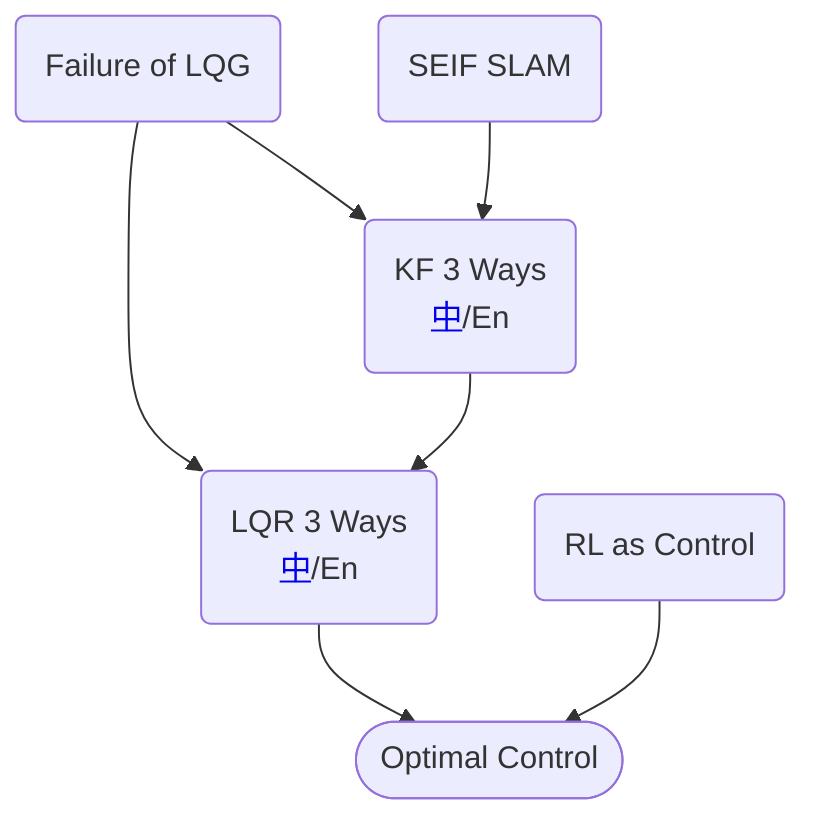

```mermaid
graph TB
    optc([Optimal Control])
    lqr(LQR 3 Ways<br><a href="https://www.bilibili.com/video/BV19Vpbz1Eyg/">中</a>/<a>En</a>) --> optc
    kf(KF 3 Ways<br><a href="https://www.bilibili.com/video/BV1WLp8zPEvS/">中</a>/<a>En</a>) --> lqr
    lqg(Failure of LQG) --> lqr
    lqg --> kf
    eifslam(SEIF SLAM) --> kf
    rlasc(RL as Control) --> optc
```
